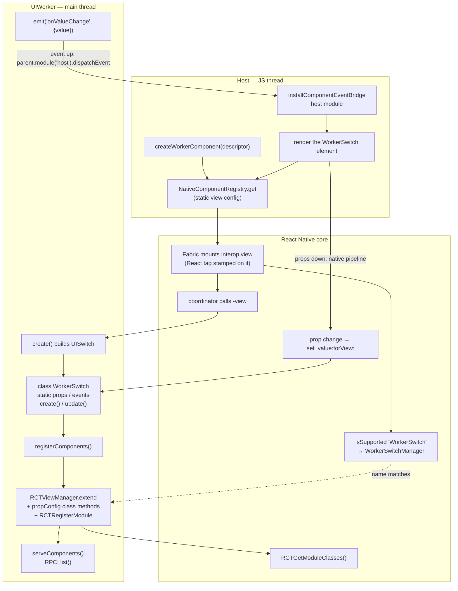

# Building a native component in JavaScript

**What you'll build:** `WorkerSwitch` — a real, native `UISwitch` used from React
like any component from a native library:

```tsx
<WorkerSwitch value={on} onValueChange={setOn} style={{ width: 51, height: 31 }} />
```

Fabric mounts it, Yoga lays it out, its `value` flows down as a **native prop** and
its change event comes back up to React state — but **its view manager is written
entirely in JavaScript and registered from inside a `UIWorker` at runtime.** No
native code, no codegen, no podspec. The same pattern builds `WorkerBadge` (a styled
label) and `WorkerMap` (a full `MKMapView` with a JS delegate).

Files: `example/src/workers/nativecomponents.ts` ·
`example/src/workers/helpers/native-component.ts` ·
`example/src/native-components/createWorkerComponent.tsx` ·
`example/src/screens/NativeComponentScreen.tsx`

:::warning[Experimental]
This builds on [`@nativescript/react-native`](../examples#nativescript-interop--the-whole-ios-sdk-from-a-worker)
(a preview package, **iOS only**) and on runtime Obj-C class building and
view-manager registration. It's a demonstration of how far a `UIWorker` can go —
not a supported, blessed API. Read it for the ideas; treat the code as a demo.
:::

:::note[What is NativeScript?]
[NativeScript](https://nativescript.org) is an open-source runtime that exposes the
entire native platform API to JavaScript. Its
[`@nativescript/react-native`](https://github.com/NativeScript/napi-ios) package
(the `napi-ios` project) brings that to iOS via libffi/JSI, so from JS you can call
any Obj-C class, C function, struct maker, and constant — including UIKit and the
RN Obj-C runtime. That's the one dependency that makes everything below possible; it
is not part of this library. See [nativescript.org](https://nativescript.org) for
the project.
:::

## The idea

A React Native "host component" (like `<View>`) is backed by a **native view
manager** — an Obj-C `RCTViewManager` subclass that builds the platform view and
declares its props. Normally you write that in Objective-C and run codegen.

But a [`UIWorker`](../guides/ui-worker) runs JS **on the main thread**, and
[`@nativescript/react-native`](../examples) exposes the whole Obj-C runtime to that
JS. So from worker JavaScript we can do everything the native manager would:

1. **build** the `UIView` (`UISwitch.alloc().init…`),
2. **subclass** `RCTViewManager` and **register** it with React Native,
3. **declare props** so RN sends them down natively, and
4. **respond** to the view's events.

React Native then treats the result as a genuine component. Props ride RN's **own
native prop pipeline**; only events come back over the worker's RPC channel (for a
reason we'll get to in Step 5). Let's build it.

## Step 1: a component is a class

The example wraps the mechanics in a small base class, `NativeComponent`
(`helpers/native-component.ts`). You write a subclass that declares its props and
events, and implements two methods:

```ts title="workers/nativecomponents.ts"
import { NativeComponent, registerComponents, serveComponents }
  from './helpers/native-component';

class WorkerSwitch extends NativeComponent {
  static props = ['value', 'tint'];
  static events = ['onValueChange'];

  create() {
    // Build the real UIKit view. Runs on the main thread.
    const view = UISwitch.alloc().initWithFrame(CGRectMake(0, 0, 51, 31));
    this.onControl(view, UIControlEvents.ValueChanged, () =>
      this.emit('onValueChange', { value: view.on })
    );
    return view;
  }

  update(props: { value?: boolean; tint?: boolean }) {
    // Apply props. Called on mount and on every host-side change.
    if (props.value != null && this.view.on !== !!props.value) {
      this.view.setOnAnimated(!!props.value, true);
    }
    if (props.tint) this.view.onTintColor = UIColor.systemGreenColor;
  }
}
```

- **`static props`** lists the prop names RN should route to `update()`.
- **`static events`** lists the `on<Event>` callback prop names.
- **`create()`** builds and returns the `UIView`. The base class stores it as
  `this.view`. One instance per mounted view.
- **`update(props)`** applies props (accumulated, so read whatever you need off
  `props`); `this.view` is always available.
- **`this.emit(event, payload)`** fires the matching `on<Event>` React prop, with
  `payload` delivered as `event.nativeEvent`.
- **`this.onControl(control, events, handler)`** wires a UIKit control event.

:::tip[Wire events in `create()`, not `update()`]
A native proxy isn't a stable JS identity, so a `view.__wired` guard doesn't
survive, and wiring from `update()` would add a *fresh* target/action on every prop
change (double-firing events). Do it once, in `create()`.
:::

## Step 2: register it with React Native

One call publishes your classes:

```ts title="workers/nativecomponents.ts"
registerComponents([WorkerBadge, WorkerSwitch, WorkerMap]);
serveComponents();
```

`registerComponents` is where the runtime magic happens. For each class it builds an
Obj-C view manager and drops it into RN's module list:

```ts
const Manager = RCTViewManager.extend(
  {
    view() { /* new instance; return instance.create() */ },
    // ...one propConfig + setter per declared prop (Step 4)
  },
  { name: `${name}Manager`, exposedMethods /* signatures for the new methods */ }
);
RCTRegisterModule(Manager);
```

Three details make this work, all Obj-C-runtime facts you can lean on:

1. **`RCTViewManager.extend({ view() {…} }, …)`** allocates a real Obj-C class at
   runtime whose `-view` method is your JS function. (`-view` already exists on
   `RCTViewManager`; NativeScript's `extend` can override existing members.)
2. **The class is named `<Component>Manager`.** `RCTViewManager` uses
   `RCT_EXPORT_MODULE()` with no argument, so its `+moduleName` is `@""`, and
   RN's legacy-interop layer falls back to *"class name minus `Manager`"* to name
   the component. So `WorkerSwitchManager` → the component `WorkerSwitch`.
3. **`RCTRegisterModule()`** drops the class into `RCTGetModuleClasses()` — the
   exact list RN scans when deciding whether a component name is supported.

When the host later renders `<WorkerSwitch>`, Fabric asks
`RCTComponentViewFactory` if the name is supported, the scan finds
`WorkerSwitchManager`, and RN mounts a legacy-interop view whose coordinator calls
your `-view` to build the `UISwitch`.

`serveComponents()` exposes a tiny RPC module (`nativecomponents`) with a single
`list()` method that returns the registered component descriptors — the host queries
it **once** to learn each component's name, props, and events. It's not on the
per-prop path.

## Step 3: resolve it on the host

The host side (`native-components/createWorkerComponent.tsx`) turns a component
descriptor into a React component:

```tsx
import * as NativeComponentRegistry
  from 'react-native/Libraries/NativeComponent/NativeComponentRegistry';

const validAttributes = {};
for (const prop of descriptor.props) validAttributes[prop] = true;

const Host = NativeComponentRegistry.get(descriptor.name, () => ({
  uiViewClassName: descriptor.name,
  validAttributes,   // the native props RN is allowed to send down
}));
```

Why `NativeComponentRegistry.get` and **not** `requireNativeComponent`? The public
`requireNativeComponent` takes the legacy path and asks *native* for the view
config — which a view manager registered at runtime can't answer. In bridgeless
mode `NativeComponentRegistry.get` uses the **static** view config
(`native: !global.RN$Bridgeless`), i.e. the JS-authored one you pass in. The
`validAttributes` map is what tells RN which props are real native props to send
down the pipeline — so it must list exactly the names the worker declared.

## Step 4: props go down natively

Props flow down **React Native's own native pipeline** — the same one a codegen'd
component uses. You declare a prop's name in `static props`, and `registerComponents`
does the rest: it tells RN about the prop and wires a setter that calls straight into
your `update()`.

```ts
// the helper's setter, added per declared prop — RN calls it when the prop changes:
set_value(json, view) {
  const instance = instances.get(view);   // view → your NativeComponent
  const state = { ...prevProps, value: toJS(json) };
  instance.update(state);                  // your update() runs, on the main thread
}
```

So a prop change on the host travels down RN's commit → mount pipeline and calls
your worker's `update()` directly — no RPC message, no tag bookkeeping. The host
wrapper does nothing but forward the prop:

```tsx
<Host ref={ref} style={style} {...nativeProps} />   // RN sends value/tint down natively
```

Style and layout still go through Yoga natively, and the `RCTView` props the manager
inherits (`backgroundColor`, `opacity`, …) keep working the native way.

## Step 5: events come back over RPC

Events go the other way, over the worker's [RPC channel](../rpc/jsmodule-bridge).
`this.emit()` sends the event to the host, which delivers it to the matching
`on<Event>` callback prop:

```ts
// worker: emit() fires an event to the host, keyed by the view's React tag
emit(event, payload = {}) {
  parent.module('host').dispatchEvent({ tag: reactTag(this.view), event, payload });
}
```

```tsx
// host: installComponentEventBridge(worker) routes it to the right instance's callback
worker.registerModule('host', {
  dispatchEvent({ tag, event, payload }) {
    eventTargets.get(tag)?.(event, payload);   // → props.onValueChange({ nativeEvent: payload })
  },
});
```

The payload arrives as `{ nativeEvent: payload }`, so a worker component's event
handler reads **exactly** like a native one:

```tsx
<WorkerSwitch onValueChange={(e) => setOn(e.nativeEvent.value)} />
```

## Step 6: use it like any component

Put it together on the host:

```tsx title="screens/NativeComponentScreen.tsx"
const w = new UIWorker('../workers/nativecomponents', { nativeModules: true });
installComponentEventBridge(w);

await w.ready('nativecomponents', 8000);
const descriptors = await w.module('nativecomponents').list(); // one-time query
const WorkerSwitch = createWorkerComponent(descriptors.find(d => d.name === 'WorkerSwitch'));

// ...then render it like anything else:
<WorkerSwitch
  value={on}
  tint
  onValueChange={(e) => setOn(e.nativeEvent.value)}
  style={{ width: 51, height: 31 }}
/>
```

`value` flows down as a native prop; the change event comes back up over RPC to
React state — the whole loop running through the worker, on the main thread.

## Why props are native and events are RPC

Native props are the better default: they ride React Native's own pipeline, so
several prop changes in one render batch into a single update, and they need no
extra channel of their own. Events use RPC simply because that's the direction the
native pipeline can't cover here — so we send them back over the worker bridge, and
deliver them as `{ nativeEvent }` so handlers still look native.

Performance-wise the two are close: both cross the JS-thread → UI-thread boundary
exactly once, which is the part that actually costs. The only time a plain RPC (or
[`SharedValue`](../shared-data/shared-value)) call beats a native prop is a single
value updating very fast — a slider dragging one number at 60fps. For everything
else, keep props native.

## The reusable pieces

Everything component-*specific* is just the `WorkerSwitch` class. The rest is
generic plumbing you'd extract into a library once and never touch again — two
small helpers.

**Worker side — `helpers/native-component.ts`:**

| Export | What it does |
| --- | --- |
| `class NativeComponent` | The base class: declare `static props` / `static events` (and optional `static componentName`), implement `create()` / `update(props)` / `dispose()`. Gives you `this.view`, plus `emit(event, payload)`, `onControl(control, events, cb)`, and `delegate(protocols, methods)` for building Obj-C delegates from JS. One instance per mounted view. |
| `registerComponents(classes)` | For each class, builds a runtime `RCTViewManager` subclass: a `-view` method, and per declared prop the metadata + setter RN needs to send it down natively. Registers it with `RCTRegisterModule`, remembers `name → descriptor` (re-registering the same name is a no-op), and returns the descriptors. |
| `serveComponents()` | Registers the `nativecomponents` RPC module with a single `list()` that returns the descriptors — a one-time host query, not a per-prop channel. |

**Host side — `native-components/createWorkerComponent.tsx`:**

| Export | What it does |
| --- | --- |
| `createWorkerComponent(descriptor)` | Returns a React component. Resolves the host view via `NativeComponentRegistry.get` (using the descriptor's props as `validAttributes`), splits `on*` callbacks from native props, forwards the native props straight to the host view, and registers the callbacks by React tag so events reach them. |
| `installComponentEventBridge(worker)` | Registers the host-side `host` RPC module so a worker `emit()` reaches the right mounted instance's callback prop, routed by tag, delivered as `{ nativeEvent }`. Call once per worker. |

To add a **new** component you write only a new `NativeComponent` subclass (declaring
its `props`/`events`) and drop it into `registerComponents([...])`. The helpers don't
change — that's the whole idea.

## The whole flow

Three things happen: the worker **registers** a view manager with RN (once); the
host **mounts** the component, which drives RN to call the worker's `create()`; and
at runtime **props flow down natively** and **events flow up over RPC**, keyed by the
view's React tag.



Read it as three passes: the **registration** path (`WorkerSwitch` →
`registerComponents` → `RCTRegisterModule` → `RCTGetModuleClasses`), the **mount**
path (render → `NativeComponentRegistry.get` → Fabric → `-view` → your `create()`),
and the two runtime **channels** — props down through RN's native `set_<name>:`
setter into your `update()`, and events up through the host `host` module back to
your callback prop.

## Why the persistent UIWorker runtime matters

This example is the reason [`UIWorker` runtimes are shared and persistent by
default](../guides/ui-worker#shared-persistent-runtimes). `RCTRegisterModule` is
**permanent** — React Native has no way to *unregister* a view manager. So the
runtime that owns those classes' `-view` closures must live as long as the
registration: for the whole process.

That's exactly what the persistent default gives you. The natural per-screen
pattern just works:

```tsx
useEffect(() => {
  const w = new UIWorker('../workers/nativecomponents', { nativeModules: true });
  // ...resolve + render...
  return () => w.terminate(); // disconnect this handle; runtime persists
}, []);
```

- **First visit** evaluates the worker and registers the managers.
- **Navigating away** calls `terminate()` — a handle disconnect, *not* a teardown.
- **Coming back** reconnects to the same runtime; the managers are already
  registered, so it just works, instantly.

:::danger[Do not use `independent` or `terminateRuntime()` here]
Both recreate the runtime, and a second runtime that registers the same component
names collides — while RN's cache still points the name at the reaped runtime,
which crashes on the next render. This is an RN limitation, not a worker bug. A
component-registering worker must be the shared, persistent kind. See the warning
in the [UIWorker guide](../guides/ui-worker#opting-out-independent).
:::

## Going further: `WorkerMap`

`WorkerBadge` follows the same shape with a `UILabel`. `WorkerMap` goes further: a
full `MKMapView` whose `MKMapViewDelegate` is written in JS via
`this.delegate('MKMapViewDelegate', { … })` — custom `MKMarkerAnnotationView`s,
pin-selection and region-change callbacks, and struct-based camera control
(`CLLocationCoordinate2DMake`, `MKCoordinateRegionMakeWithDistance`). Its `lat`,
`lng`, `radius`, `mapType`, and `pins` are all native props that move the camera and
the annotations; the map's own `onSelectPin` / `onRegionChange` come back over RPC.
Building a delegate from JS is the single hardest thing in Objective-C interop, and
it's a few lines here. See `workers/nativecomponents.ts` for the full component.

## What to take away

- A `UIWorker` + full Obj-C interop lets you register a **real** RN view manager at
  runtime, entirely in JS — no native module, codegen, or podspec.
- **Props are native** — they ride RN's own commit/mount pipeline, batched and
  integrated with reconciliation.
- **Events come back over RPC**, delivered as `{ nativeEvent }` so handlers read just
  like a native component's.
- It only works because the worker runtime is **persistent** — permanent native
  registration demands a permanent runtime.
- It's iOS-only and experimental, but it shows the ceiling of what worker-driven
  native UI can be.
